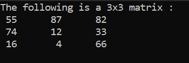
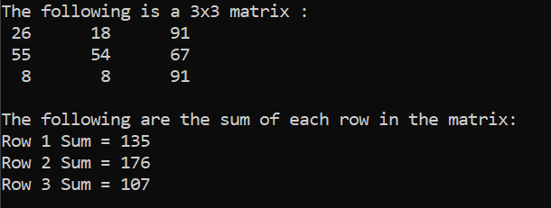
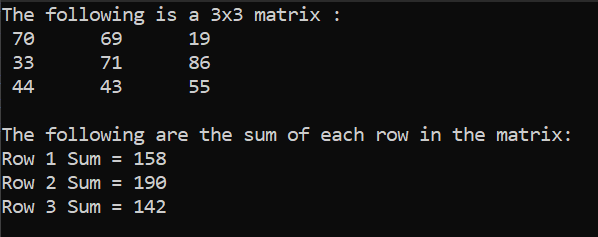
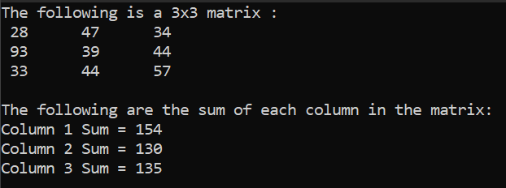
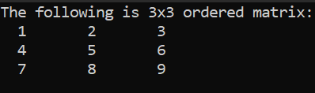
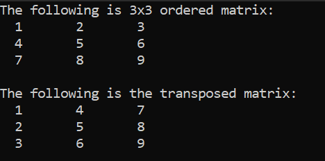
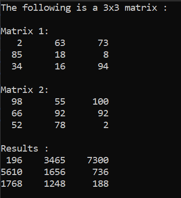

# ProblemSolvingCPPLevel3

Welcome to my C++ problem-solving repository! In this repository, I solve various algorithmic problems to enhance my programming skills in C++. Each problem is stored in its own directory, and this README will describe each of the exercises.

## Exercise 1: Matrix Generator

### Problem Statement:

The task is to create a program that generates and displays a matrix of random integers between 1 and 100, with the number of rows and columns specified by the user.

### Output:

Below is an example of the program's output:

## Exercise 2: Sum Matrix Rows

### Problem Statement:

The task is to develop a program that generates a matrix of random integers, where the integers are between 1 and 100. The user will specify the dimensions of the matrix by providing the number of rows and columns. After generating the matrix, the program will calculate and display the sum of each row in the matrix.

### Output:

Below is an example of the program's output:

## Exercice 3: Sum the Rows of a Matrix into a One-Dimensional Array

### Problem Statement

The task is to generate a 3x3 matrix of random integers between 1 and 100, calculate the sum of each row, store the row sums in a one-dimensional array, and then display the matrix along with the values in the one-dimensional array representing the row sums.

### Output:

Below is an example of the program's output:

## Exercice 4: Sum the Columns of a Matrix into a One-Dimensional Array

### Problem Statement

The task is to generate a 3x3 matrix of random integers between 1 and 100, calculate the sum of each column, store the columns sums in a one-dimensional array, and then display the matrix along with the values in the one-dimensional array representing the columns sums.

### Output:

Below is an example of the program's output:

## Exercice 6: Fill Matrix With Ordered Numbers

### Problem Statement

The task is to generate a 3x3 matrix of ordered integers from 1 to the matrix length, and then display the matrix.

### Output:

Below is an example of the program's output:

## Exercice 7: Matrix Transpose

### Problem Statement

The task is to generate a 3x3 matrix of ordered integers from 1 to 9, compute its transpose, and then display both the matrix and its transpose.

### Output:

Below is an example of the program's output:

## Exercice 8: Element-wise Multiplication of Two 3x3 Matrices with Random Values

### Problem Statement

The problem statement is to generate two 3x3 matrices with random numbers between 1 and 100, multiply them element-wise, and display the original matrices and the result of the multiplication.

### Output:

Below is an example of the program's output:

