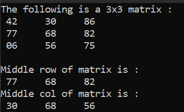
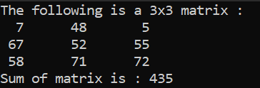
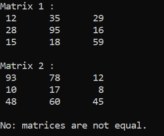
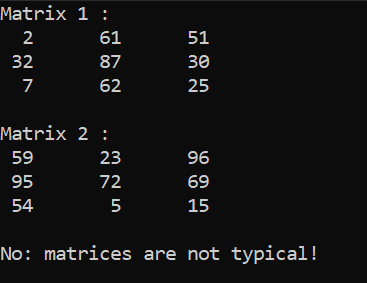
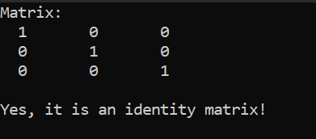
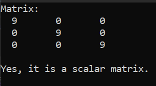
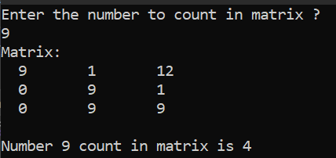
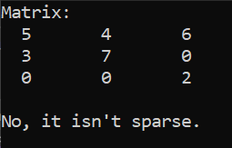
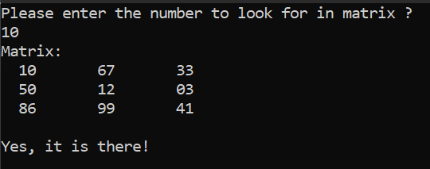
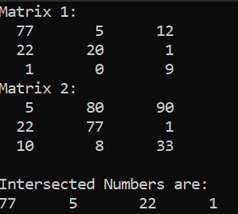

# ProblemSolvingCPPLevel3

Welcome to my C++ problem-solving repository! In this repository, I solve various algorithmic problems to enhance my programming skills in C++. Each problem is stored in its own directory, and this README will describe each of the exercises.

## Exercise 1: Matrix Generator

### Problem Statement:

The task is to create a program that generates and displays a matrix of random integers between 1 and 100, with the number of rows and columns specified by the user.

### Output:

Below is an example of the program's output:

## Exercise 2: Sum Matrix Rows

### Problem Statement:

The task is to develop a program that generates a matrix of random integers, where the integers are between 1 and 100. The user will specify the dimensions of the matrix by providing the number of rows and columns. After generating the matrix, the program will calculate and display the sum of each row in the matrix.

### Output:

Below is an example of the program's output:

## Exercice 3: Sum the Rows of a Matrix into a One-Dimensional Array

### Problem Statement

The task is to generate a 3x3 matrix of random integers between 1 and 100, calculate the sum of each row, store the row sums in a one-dimensional array, and then display the matrix along with the values in the one-dimensional array representing the row sums.

### Output:

Below is an example of the program's output:

## Exercice 4: Sum the Columns of a Matrix into a One-Dimensional Array

### Problem Statement

The task is to generate a 3x3 matrix of random integers between 1 and 100, calculate the sum of each column, store the columns sums in a one-dimensional array, and then display the matrix along with the values in the one-dimensional array representing the columns sums.

### Output:

Below is an example of the program's output:

## Exercice 6: Fill Matrix With Ordered Numbers

### Problem Statement

The task is to generate a 3x3 matrix of ordered integers from 1 to the matrix length, and then display the matrix.

### Output:

Below is an example of the program's output:

## Exercice 7: Matrix Transpose

### Problem Statement

The task is to generate a 3x3 matrix of ordered integers from 1 to 9, compute its transpose, and then display both the matrix and its transpose.

### Output:

Below is an example of the program's output:

## Exercice 8: Element-wise Multiplication of Two 3x3 Matrices with Random Values

### Problem Statement

The task is to generate two 3x3 matrices with random numbers between 1 and 100, multiply them element-wise, and display the original matrices and the result of the multiplication.

### Output:

Below is an example of the program's output:

## Exercice 9: Print Middle Row And Column Of A Matrix

### Problem Statement

The task is to generate a 3x3 matrix with random numbers between 1 and 100 and display both the middle row and the middle column of the matrix.

### Output:

Below is an example of the program's output:

## Exercice 10: Sum Matrix Elements

### Problem Statement

The task is to generate a 3x3 matrix with random numbers between 1 and 100, calculate the sum of the matrix elements, and display both the matrix and the sum.

### Output:

Below is an example of the program's output:

## Exercice 11: Check Matrices Equality

### Problem statement

The task is to generate two matrices filled with random numbers between 1 and 100. After generating the matrices, calculate the sum of the elements in each matrix. Then, compare the two sums and display both matrices along with the result of the comparison, indicating whether the sums are equal or not.

### Output:

Below is an example of the program's output:

## Exercice 12: Check Matrices Equality

### Problem statement

The task is to generate two matrices filled with random numbers between 1 and 100. After generating the matrices, compare each element in the first matrix with the corresponding element at the exact position in the second matrix. Then, display both matrices along with the result of the comparison, indicating whether the matrices are identical or not.

### Output:

Below is an example of the program's output:

## Exercice 13: Check Matrix Identity

### Problem statement

The task is to verify whether a given matrix is an identity matrix. This can be done by checking if the diagonal elements are all ones and if all other elements are zeros. After performing the verification, display the matrix along with the result of the verification.

### Output:

Below is an example of the program's output:

## Exercice 14: Check Scalar Matrix

### Problem statement

The task is to verify whether a given matrix is a scalar matrix. This can be done by checking if the diagonal elements are all identical and if all other elements are zeros. After performing the verification, display the matrix along with the result of the verification.

### Output:

Below is an example of the program's output:

## Exercice 15: Count Number In Matrix

### Problem statement

The task is to prompt the user for a number and calculate its frequency in the matrix. Then, display the matrix along with the frequency of the given number.

### Output:

Below is an example of the program's output:

## Exercice 16: Check Matrix Sparsity

### Problem statement

The task is to check if the matrix is sparse, meaning that the number of zero elements is greater than the number of non-zero elements. Then, display the matrix along with the result of the sparsity check.

### Output:

Below is an example of the program's output:

## Exercice 17: Number Existence in Matrix

### Problem statement

The task is to prompt the user for a number and check if it exists in a given matrix. Then, display the matrix along with the result, indicating whether the number exists or not.

### Output:

Below is an example of the program's output:

## Exercice 18: Intersected Numbers in Matrices

### Problem statement

The task is to find the intersecting numbers in two matrices, store them in a one-dimensional array, and then display the two matrices along with the resulting array.

### Output:

Below is an example of the program's output:

